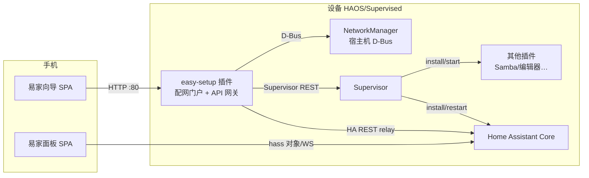

# 01 · 总体架构

## 设计原则

1. **不动 HA 内核**：全部定制通过官方扩展点实现（Add-on、`panel_custom`、configuration.yaml、Supervisor REST API、NetworkManager D-Bus）。官方升级不受影响，代码可长期维护。
2. **后端不自研**：所有业务能力（装插件、建账号、配置集成、读设备状态）都调用 Home Assistant / Supervisor 官方 API。本项目的 Python 后端只做两件"胶水"事：**WiFi 配网（必须操作宿主机网卡）** 和 **静态页托管**。
3. **移动优先**：目标用户用手机完成一切。重写的页面只有两个：初始化向导 + 「易家」日常面板。

## 组件图

## 关键链路

### 1. 配网（首次开机）
- 无网络时，`server.py` 后台线程经 **host_dbus** 调用宿主机 NetworkManager：
  `AddAndActivateConnection({wifi mode=ap, ipv4.method=shared})` 开热点 `EasyHA-Setup`。
  `shared` 模式自带 DHCP/DNS/NAT，手机连上即有本地网络。
- 手机探测请求（`/generate_204` 等）被门户 302 到配置页；二维码内容固定 `http://easyha.local`（mDNS 由容器内 python3-zeroconf 注册）。
- 用户选 WiFi 输密码 → `AddAndActivateConnection(infrastructure + wpa-psk)`，**NM 自动持久化**，之后每次开机自动回连（满足"平常也用 WiFi"）。

### 2. 初始化（替代官方 onboarding）
向导通过门户 API 完成以下动作（全部官方接口）：

| 向导步骤 | 后端动作 | 官方接口 |
|---|---|---|
| 创建账号 | 建管理员 | `POST /api/onboarding/users` |
| 一键装机 | 装小米 Miot / HACS | 下载 zip → `/config/custom_components`（中国镜像回退） |
| | 装常用插件 | `POST /addons/{slug}/install`、`/start` |
| | 写入易家面板/时区/免登录 | 深度合并 `configuration.yaml`（panel_custom + trusted_networks） |
| | 重启生效 | `POST /homeassistant/restart` |
| 完成识别 | 跳过剩余引导、数设备 | `POST /api/onboarding/*`、`GET /api/states` |
| 绑定小米 | 通用配置流渲染器 | `POST /api/config/config_entries/flow[/{id}]` |

### 3. 日常使用
- **「易家」面板**：`panel_custom` + `module_url: /local/easyha/app.js`。与 HA 同源运行，
  直接使用 HA 前端注入的 `hass` 对象（状态、服务调用、房间/设备注册表 API），零后端、零跨域。
- **免登录**：`http.trusted_networks` 指向家庭子网 + `trusted_networks_allow_bypass_login`，
  家里 WiFi 下打开 `easyha.local:8123` 直接进入（米家级体验，可关）。
- **手机桌面**：控制台本身是 PWA，向导完成页引导「添加到主屏幕」。

## 两条落地路线

- **路线 A（官方 HAOS + 本仓库）**：HAOS 不允许开机脚本，所以首次需要人在插件商店添加
  本仓库 URL 并安装 `easy-setup`（约 1 分钟，是路线 A 唯一的手工步骤）。之后的配网/向导全自动化。
- **路线 B（定制镜像）**：树莓派 OS Lite + HA Supervised，宿主机自己管 NM/dnsmasq/avahi。
  `firstboot.sh` 在 Supervisor 就绪**之前**就提供热点配网（preportal），真正做到开箱零网线零配置，
  并自动注册插件仓库、预装 easy-setup。适合做成产品镜像。详见 `docs/04-build-images.md`。

## 安全边界说明

- 免登录等于"局域网内任何人可管理"，与米家网关的默认行为一致，但请按需关闭。
- 门户 `/api/ha/*` 转发仅放行 `config / states / services / onboarding / template / events` 白名单前缀。
- 配网热点建议保持免密（配置窗口极短），或在插件选项里设置密码。
