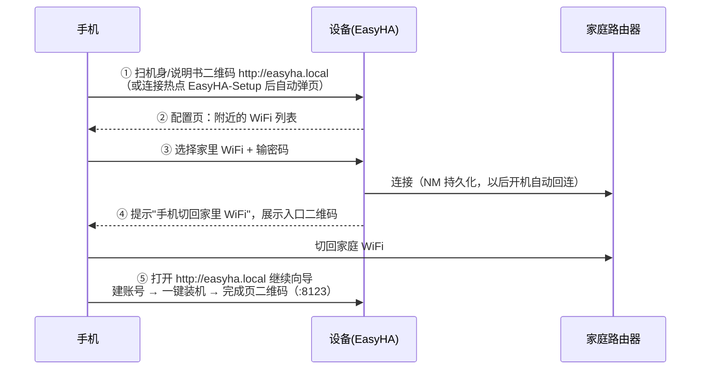

# 03 · 扫码配网流程（手机直连 WiFi 初始化）

## 用户视角（全程手机，5 步）

## 技术细节

### 热点与 captive portal
- 热点由宿主机 NetworkManager 创建：`mode=ap` + `ipv4.method=shared`（DHCP/DNS/NAT 内置）。
- 门户监听宿主 80 端口，对 iOS/Android/Windows/Kindle 的联网探测路径
  （`/generate_204`、`/hotspot-detect.html`、`/ncsi.txt` 等）一律 302 到 `/`，
  多数手机会自动弹出"登录到网络"窗口。
- DNS：路线 B 镜像里装了 `dnsmasq`，NM shared 模式用它做 DNS 转发，captive 检测成功率高；
  HAOS（路线 A）宿主机没有 dnsmasq，可能不自动弹窗 —— 用户手动开二维码地址即可（二维码
  内容就是门户地址，这也是把二维码印在机身/说明书上的原因）。

### 二维码内容为什么是固定的 `http://easyha.local`
- 热点名固定（`EasyHA-Setup`）、免密，mDNS 域名固定 `easyha.local`，
  因此**一台设备一张标签即可量产**，不需要每台生成动态二维码。
- mDNS 由两处保证：引导阶段 avahi-daemon（路线 B）；插件阶段 python3-zeroconf（注册 A 记录）。
- IP 直连兜底：完成页与向导多处同时展示当前 IP 地址。

### 连接失败自愈
- `POST /api/wifi/connect` 后台线程执行连接；60 秒未激活判定失败，删除新建连接、
  重新拉起热点，前端回到密码页。错误信息直接展示给用户。
- 配网成功后热点被停用（`stop_ap`），设备与手机同在家庭 WiFi，门户继续可用。

### 「平常也用 WiFi」
- NM 连接配置 `autoconnect=yes` 持久化在数据分区，重启自动回连。
- 之后若家里换路由器/改密码：连不上时设备自动重开热点，用户重新配网即可（self-healing）。
- 需要固定地址的话，向导完成后建议在路由器里给 `easyha` 做 DHCP 保留；
  日常访问用 `http://easyha.local:8123` 不依赖 IP。

### HAOS（路线 A）注意事项
- `host_dbus` 需要插件声明（本插件已声明）。个别老版本 HAOS 的 polkit 可能限制容器访问
  NM 的 `AddAndActivateConnection`，如遇"未找到无线网卡/权限拒绝"，用路线 B，
  或临时用 HAOS 官方 USB 配置法（CONFIG U 盘放 NetworkManager keyfile）完成首次联网。
